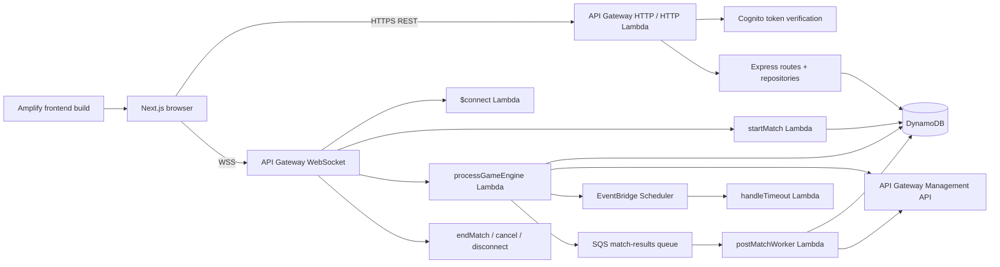
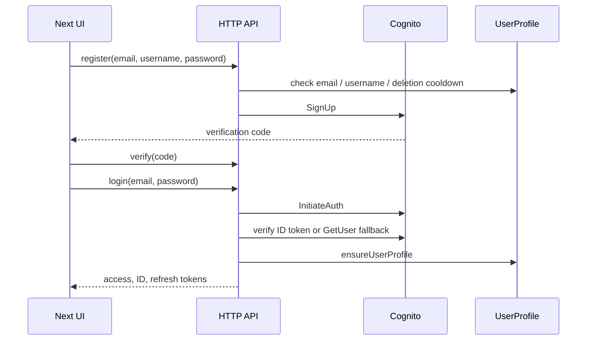
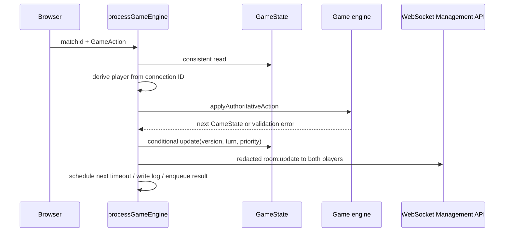

# TCG / Kaleidoscope Game: Project Architecture

> Generated from the repository source and configuration visible on 2026-09-16. This document describes verified behavior. Statements marked **INFERRED** or **UNKNOWN** are not proven by checked-in deployment templates.

## 1. Project Overview

This is a TypeScript collectible card game with a Next.js frontend and a serverless-oriented backend. The backend has two coexisting execution models:

- **Production-oriented path:** API Gateway WebSocket routes invoke Lambda handlers, which persist authoritative matches in DynamoDB and push redacted state through the API Gateway Management API. HTTP routes are packaged behind `@codegenie/serverless-express`.
- **Local/prototype path:** `Back-end/src/server/index.ts` starts an Express server and Socket.IO server with in-memory rooms, matchmaking, and timers.

The game engine itself is shared TypeScript code. It is reducer/state-machine-like, validates actions, applies deterministic transitions, emits internal events, resolves abilities/effects, cleans up dead units, and checks win conditions.

The repository does not contain complete Amplify backend/resource definitions. `amplify.yml` configures only the Next.js frontend build, so the exact deployed API Gateway routes, Lambda event mappings, IAM policies, SQS event source mapping, Scheduler target, and Cognito resource identifiers are **UNKNOWN** from source alone.

## 2. Technology Stack

| Area | Technology / evidence |
|---|---|
| Language/runtime | TypeScript, ESM, Node.js >=24 |
| Frontend | Next.js 15 (support component), React 19, Tailwind/PostCSS, Zustand and UI libraries, Phaser 4.2.1/Phaser Splash (main template, component) |
| HTTP backend | Express 5, `@codegenie/serverless-express` |
| Realtime | API Gateway WebSocket + Management API in Lambda; Socket.IO locally |
| Authentication | Amazon Cognito, Cognito JWKS verification with `jose`, bearer/cookie tokens |
| Persistence | DynamoDB Document Client |
| Async processing | Amazon SQS for completed match results |
| Scheduling | AWS EventBridge Scheduler via `@aws-sdk/client-scheduler` |
| Deployment evidence | Amplify frontend build; Lambda bundling scripts using esbuild |
| Testing | Vitest; TypeScript checks documented in `readme.md` |

## 3. Project Structure

```text
TCG-AWS/
├── Front-end/                 Next.js application, Phaser 4.2.1/Phaser Splashpages, components, hooks, assets
├── Back-end/src/
│   ├── auth/                  Cognito operations, JWT verification, HTTP middleware
│   ├── aws-lambdas/           WebSocket and async Lambda entry points
│   ├── config/                Environment and DynamoDB client setup
│   ├── database/              Table bootstrap and TypeScript persistence shapes
│   ├── decks/                 Deck payload validation
│   ├── game/                  Shared authoritative game engine
│   ├── http/                  Express app and REST route modules
│   ├── leaderboard/           Projection, ranking, realtime rank notifications
│   ├── matchmaking/           Local in-memory queue/ELO helpers
│   ├── user/                  Profile/deck repository and user service
│   ├── shared/                Multiplayer contracts shared with the frontend
│   └── server/                Local Express + Socket.IO bootstrap
├── scripts/                   Lambda/esbuild packaging
├── amplify.yml                Frontend Amplify build configuration only
├── package.json               Commands and dependencies
└── Architecture.md            This architecture report
```

The checked-in `Back-end/src/database/setupTables.ts` defines `UserProfile`, `AccountDeletionCooldown`, `GameState`, `GameLogs`, `Connections`, and `MatchHistory`, all using on-demand billing. It is a bootstrap script, not a complete infrastructure-as-code deployment.

## 4. Architecture Overview



The durable boundary is DynamoDB. Lambda invocations are stateless; `GameState.engine_state` is the authoritative game snapshot, and conditional writes provide optimistic concurrency control for actions and timeouts.

## 5. Module / Component Responsibilities

- **Frontend:** routes and UI under `Front-end/src/app`, game rendering under `components/game`, orchestration in `hooks/useGameMatch.ts`, REST in `libs/api.ts`, and transport selection in `libs/socket.ts` / `libs/apiGatewaySocket.ts`.
- **HTTP layer:** `Back-end/src/http/app.ts` applies origin checks, JSON parsing, cookies, auth routes, match/deck/leaderboard/user routes, health, and error handling. `aws-lambdas/httpBackend.ts` wraps it for Lambda.
- **Auth:** Cognito registration/login/password flows live in `auth.service.ts`; `auth.middleware.ts` accepts an access token from a cookie or bearer header; `verifyToken.ts` checks issuer, JWKS signature, access token use, and client ID.
- **Match lifecycle:** `startMatch.ts` creates/resumes rooms and public/private matches; `connectHandler.ts` authenticates and stores/rebinds connections; `processGameEngine.ts` applies player actions; `handleTimeout.ts` applies scheduled AFK transitions; `endMatch.ts`, `cancelMatch.ts`, and `disconnectHandler.ts` handle terminal/connection cases.
- **Game engine:** `game/core/engine.ts` coordinates action validation, state transitions, abilities, effects, triggers, graveyard cleanup, champion progress, and win checks. `game/rules` owns legal actions and constants; `game/operations` owns atomic state operations; `game/entities` owns card definitions/instances and registry.
- **Results and rankings:** `matchResultQueue.ts` publishes completed matches to SQS; `postMatchWorker.ts` transactionally updates both profiles and histories; `rebuildLeaderboardRanks.ts` periodically ranks profiles and notifies changed players.
- **Local server:** `server/index.ts` duplicates HTTP route mounting and owns a process-local Socket.IO room map. This path is useful for development but is not the same persistence model as the Lambda path.

## 6. Application Entry Points & Lifecycle

### Frontend

`npm run dev` runs `next dev Front-end`; `npm run build` and `npm start` build/serve the Next app. Amplify runs `npm ci` and `npm run build` with `Front-end` as `appRoot`.

### HTTP production path

API Gateway invokes `aws-lambdas/httpBackend.ts`, which adapts `http/app.ts`. The app validates origin, parses cookies/JSON, authenticates protected routes, calls repositories/AWS clients, and returns JSON.

### WebSocket production path

1. The browser obtains/refreshes a Cognito access token.
2. `ApiGatewaySocket` opens `NEXT_PUBLIC_WS_URL` with token and username query parameters.
3. API Gateway invokes `connectHandler.ts`; it verifies Cognito, records `Connections`, and may rebind a resumable match.
4. A route invokes `startMatch.ts` for public matchmaking, private room creation/join, or resume.
5. Player actions invoke `processGameEngine.ts`; terminal surrender may use `endMatch.ts`.
6. Disconnects invoke `disconnectHandler.ts`; stale queue entries are deleted and active players are marked disconnected.
7. Turn schedules invoke `handleTimeout.ts` asynchronously.

### Local lifecycle

`npm run dev:socket` runs `server/index.ts`, which creates an HTTP server, mounts Express routes, attaches Socket.IO, and keeps rooms/state/timers in process memory. `MatchmakingService`, `OnlinePlayerManager`, and `MatchmakingQueue` are local-only.

## 7. Main Flows

### Registration and login



### Matchmaking and room creation

`startMatch.ts` supports public and private match routes, validates deck selections, loads authoritative user profiles, uses a DynamoDB lock for public matching, creates a `WAITING` record, and transitions it to `IN_PROGRESS` when paired. It stores player user IDs, connection IDs, selected deck data, profiles, engine state, versions, and TTL metadata. Exact API Gateway route-to-Lambda configuration is **UNKNOWN**.

### Authoritative action



`COMMIT_BLOCKS` is deliberately followed by server-side `RESOLVE_COMBAT` in one Lambda invocation to avoid a client-visible race.

### Completed match

The engine writes `FINISHED`, winner, end reason, and timestamp. A result message goes to SQS. `postMatchWorker.ts` rereads GameState, rejects malformed/unfinished matches, calculates ELO, updates both profiles and both histories plus an idempotency marker in one DynamoDB transaction, then sends best-effort realtime profile notifications.

## 8. Data Flow

1. Cognito supplies identity tokens; the application uses `sub` as the user ID.
2. User profile reads provide username, avatar, ELO, stats, and saved decks.
3. Match start converts selected/default card IDs into card instances and stores the initial `GameState` in `GameState`.
4. WebSocket actions read, validate, transform, and conditionally replace `engine_state`.
5. Player-specific outbound messages redact the opponent hand and deck using placeholder card instances.
6. `GameLogs` records action/timeout/end audit entries independently of committed state.
7. SQS carries only a completion signal and match ID; the worker trusts the committed GameState over message-supplied player/winner fields.
8. Worker profile projections feed `LeaderboardIndex`; scheduled rebuild assigns ranks and sends rank-change events.

## 9. Event Flow

There are two distinct event systems:

- **In-game synchronous events:** `game/core/events.ts` and `game/mechanics/triggers.ts` emit events such as card play, spell cast, unit death, damage, and champion level-up. Abilities enqueue effects, operations mutate state, and cleanup repeats until stable.
- **AWS asynchronous events:** API Gateway WebSocket route events invoke Lambdas; EventBridge Scheduler invokes timeout Lambda payloads; SQS invokes the post-match worker. Direct EventBridge event-bus usage is not present; only the Scheduler client is verified.

Important external messages include `room:update`, `room:created`, `matchmaking:found`, `matchmaking:cancelled`, `match:ended`, `match:resume_required`, `profile:updated`, and `rank:changed`.

## 10. State Management & State Transitions

The game state contains both players, phase, active/priority player, attack token, round/mana, board/hand/deck/graveyard, combat, effect queue, pending choices, champion progress, visual events, turn timestamps, and terminal fields. The exact full interface is in `game/types.ts`.

Typical match states are:

```text
WAITING -> IN_PROGRESS -> FINISHED
   |             |          |
 cancel       timeout    post-match worker
 disconnect   surrender   history/rating
```

Within `IN_PROGRESS`, legal phases are `ACTION -> BLOCK -> COMBAT -> ACTION`, with `DISCARD` and pending ability choices acting as blocking sub-states. `validateAction` rejects actions after a winner, from the wrong player/phase, during unresolved choices, or after a turn deadline. `checkWinConditions` handles Nexus destruction and double destruction; timeout and surrender use explicit end reasons.

State concurrency is optimistic: `processGameEngine` and `handleTimeout` condition writes on status, state version, turn timestamps, and priority player. A failed condition returns a conflict/no-op rather than overwriting a newer transition.

## 11. API / Service Communication

### HTTP routes

The Express route modules expose authentication, `/matches`, `/decks`, `/leaderboard`, and `/user` endpoints. The local bootstrap also defines some duplicate deck and pending-match routes directly. `GET /health` exists only in `http/app.ts`.

### WebSocket routes

Production client route names include `matchfinding-start`, `room-create`, `room-join`, `game-action`, `game-surrender`, and `matchfinding-cancel`. The local Socket.IO contract uses `matchmaking:start`, `room:create`, `room:join`, `game:action`, `game:reset`, `developer:resources`, and `matchmaking:cancel`. The adapter in `libs/socket.ts` translates between these protocols.

### Outbound transport

Lambdas use `ApiGatewayManagementApiClient.PostToConnectionCommand`; gone connections are treated as expected cleanup. The browser uses native WebSocket for API Gateway and `socket.io-client` locally.

## 12. Database / Data Model

| Table | Key | Role |
|---|---|---|
| `UserProfile` | `user_id`; GSI `LeaderboardIndex` on `leaderboard_scope` + `leaderboard_sort` | identity, stats, decks, rank and leaderboard projection |
| `AccountDeletionCooldown` | `email` | 24-hour registration cooldown after deletion |
| `GameState` | `match_id` | match lifecycle, players, connections, engine snapshot, versions, TTL |
| `GameLogs` | `match_id` + `action_sequence` | action/timeout/end audit log |
| `Connections` | `connection_id` | authenticated socket and current match binding |
| `MatchHistory` | `user_id` + `played_at` | per-player completed match history |

The code frequently scans `GameState`, `UserProfile`, and `Connections` because no matching/query GSIs are defined in `setupTables.ts`. This is functional for a small prototype but is a scaling concern.

There are two similar type vocabularies: the active engine model uses camelCase (`engine_state` stores `players`, `nexusHp`, etc.), while `database.types.ts` contains an older snake_case `GameState` model. The latter is not the shape used by the current engine Lambdas and is an architectural inconsistency.

## 13. Authentication & Authorization

- Cognito is the identity provider for registration, confirmation, login, refresh, logout, password recovery, and global sign-out.
- HTTP authentication accepts an access token from `access_token` cookie or `Authorization: Bearer` and verifies the Cognito issuer/JWKS, `token_use=access`, and configured client ID.
- WebSocket `$connect` extracts a query token or bearer header and performs the same verification before writing `Connections`.
- HTTP route authorization uses the verified `sub`; WebSocket action authorization derives P1/P2 from the connection ID and rejects mismatched `action.playerId`.
- `processGameEngine` rejects client `RESOLVE_COMBAT`, server-only behavior, stale turns, and unauthorized connections.
- **Risk:** putting access tokens in the WebSocket URL query string is observable in some proxy/access-log configurations. The implementation is verified, but the deployment logging posture is **UNKNOWN**.

## 14. External Integrations

- **Amazon Cognito:** user pool authentication and JWKS endpoint.
- **Amazon DynamoDB:** all durable application state through AWS SDK v3.
- **API Gateway WebSocket:** inbound connection/route events and outbound Management API pushes.
- **SQS:** completed match result delivery with batch failure reporting.
- **EventBridge Scheduler:** one schedule per match state version for turn timeout; target is `handleTimeout` through an IAM scheduler role.
- **Amplify:** verified as frontend build/deployment configuration only. Backend resource provisioning is **UNKNOWN**.
- **Secrets Manager / STS:** optional custom DynamoDB credential paths exist in `config/dynamodb.ts`; Lambda normally uses its execution role.

## 15. Configuration & Environment

Important settings include `AWS_REGION`/`DB_REGION`, table-name overrides, `COGNITO_REGION`, `COGNITO_USER_POOL_ID`, `COGNITO_CLIENT_ID`, optional Cognito client secret, `FRONTEND_ORIGINS`, `WS_MANAGEMENT_ENDPOINT`, `SQS_MATCH_RESULTS_QUEUE_URL`, `TURN_TIMEOUT_SCHEDULER_ROLE_ARN`, `HANDLE_TIMEOUT_LAMBDA_ARN`, scheduler group, match/queue TTLs, matchmaking ELO range, and frontend `NEXT_PUBLIC_API_URL`, `NEXT_PUBLIC_WS_URL`, `NEXT_PUBLIC_SOCKET_URL`, and route overrides.

Local dotenv loading reads `Back-end/.env`; Lambda skips dotenv. The actual `.env` values are intentionally not documented here. Required env validation occurs during module initialization, so missing Cognito settings can fail cold start.

The project scripts build each Lambda with esbuild into a zip. There is no checked-in template showing how these zips are uploaded, how routes are mapped, or how IAM is created.

## 16. Important Business Logic

- Game constants include 20 starting Nexus HP, up to 10 mana, 3 spell mana, four starting cards, six-card hand and six-unit board limits.
- Action rules enforce priority, phase, attack token ownership, playable cards, additional sacrifice costs, pending target choices, and combat legality.
- Effects include damage, healing, draw/discard, buffs/debuffs, keywords, summoning, graveyard operations, recall/rebirth/revive, and filtered card creation/draw.
- Champion progress tracks deaths, spells, Nexus damage, and champion strikes; qualifying cards/units level up through registry definitions.
- ELO uses a K-factor of 32. Post-match EXP is 100 for wins, 35 for losses, and 50 for draws; level is derived from EXP.
- Leaderboard ordering is fixed-width ELO, win rate, wins, then user ID; periodic rebuilding assigns ranks while conditional writes avoid replacing newer profile updates.

## 17. Dependencies & Coupling

- Lambda handlers are tightly coupled to DynamoDB attribute names, table names, API Gateway event shape, and environment variables.
- The game engine is the strongest reusable boundary: both local Socket.IO and serverless action/timeout flows call it.
- `GameState` is a large serialized aggregate. Every action reads and rewrites the whole match snapshot, coupling rules, card registry, effects, and transport persistence.
- Realtime delivery is coupled to stored connection IDs but is intentionally best effort after state commits.
- Post-match correctness depends on the GameState status/winner and profile conditional expressions; SQS delivery is safely replayable because of `post_match_processed_at`.
- HTTP routes and `server/index.ts` duplicate endpoint behavior, increasing drift risk.

## 18. Architectural Patterns

- Stateless Lambda handlers with DynamoDB as the durable state boundary.
- Authoritative server-side state machine / reducer-style engine.
- Event-driven in-game abilities and effect queue.
- Optimistic concurrency with DynamoDB conditional writes and state versions.
- Outbox-like asynchronous completion processing through SQS, with transactional idempotency.
- Projection pattern for leaderboard sorting/ranking.
- Adapter pattern for local Socket.IO versus API Gateway WebSocket.
- Best-effort push notifications after authoritative persistence.

## 19. Critical Risks / Inconsistencies

1. **Deployment definition gap:** no checked-in backend Amplify/CDK/SAM/Serverless/IaC resource definitions were found. Production topology, permissions, route mappings, SQS trigger, Scheduler role, and TTL/index settings cannot be verified.
2. **Two runtime architectures:** local Socket.IO rooms are in memory while production matches are DynamoDB-backed. Behavior, recovery, authorization, and race handling can diverge.
3. **Duplicate HTTP routing:** `server/index.ts` and `http/app.ts` mount overlapping endpoints with different implementations and naming (`/decks` is especially duplicated).
4. **Scan-based coordination:** public matchmaking, pending-match lookup, connection rebinding, and leaderboard rebuild use table scans. Cost and latency will grow with user/match volume.
5. **Schema drift:** `database.types.ts` describes an older snake_case game state while active engine/Lambda code uses a different camelCase state. This can mislead maintainers and serializers.
6. **Large aggregate writes:** replacing serialized engine state on every action increases DynamoDB item size, write cost, and contention.
7. **Timeout scheduling fan-out:** one EventBridge schedule is created per state version. Failed IAM/configuration or schedule cleanup can leave stale schedules; correctness depends on version checks.
8. **Partial external delivery:** WebSocket push and audit logging are non-transactional UX/audit side effects. The design intentionally prioritizes committed game state, but clients require reconnect/resume handling.
9. **Credential complexity:** optional Secrets Manager, cross-account role, static key, and Lambda-role paths increase configuration surface. Static credentials must remain disabled in production.
10. **Token transport exposure:** WebSocket tokens are sent as query parameters. Confirm gateway and access-log redaction before production.
11. **Amplify scope ambiguity:** the repository name and user description imply Amplify-managed backend services, but checked-in `amplify.yml` only proves frontend hosting/build behavior.

## 20. Key Files & Entry Points

| Concern | Key files |
|---|---|
| Frontend build | `Front-end/src/app`, `Front-end/src/hooks/useGameMatch.ts`, `Front-end/src/libs/api.ts`, `Front-end/src/libs/socket.ts`, `Front-end/src/libs/apiGatewaySocket.ts` |
| HTTP Lambda | `Back-end/src/aws-lambdas/httpBackend.ts`, `Back-end/src/http/app.ts` |
| WebSocket connect | `Back-end/src/aws-lambdas/connectHandler.ts` |
| Match lifecycle | `startMatch.ts`, `cancelMatch.ts`, `disconnectHandler.ts`, `endMatch.ts` |
| Authoritative action | `processGameEngine.ts`, `game/core/authoritativeAction.ts`, `game/core/engine.ts` |
| Timeout | `turnTimeoutScheduler.ts`, `handleTimeout.ts` |
| Result processing | `matchResultQueue.ts`, `postMatchWorker.ts` |
| Ranking | `leaderboard/leaderboard.ts`, `rebuildLeaderboardRanks.ts`, `leaderboard/routes.ts` |
| Auth | `auth.service.ts`, `auth.middleware.ts`, `verifyToken.ts`, `auth.routes.ts` |
| Persistence | `config/dynamodb.ts`, `database/setupTables.ts`, `user/user.repository.ts` |
| Local runtime | `server/index.ts`, `matchmaking/*` |
| Packaging | `scripts/build-lambda.mjs`, `scripts/build-http-lambda.mjs` |

## 21. System Mental Model

Think of the system as **a durable match aggregate wrapped by stateless event handlers**:

```text
Browser
  -> Cognito token
  -> HTTP for identity/decks/history/rank
  -> WebSocket for match commands and state notifications
       -> Lambda validates connection and command
       -> Game engine computes one state transition
       -> DynamoDB conditionally commits the transition
       -> WebSocket publishes a player-redacted snapshot
       -> Scheduler arranges timeout or SQS arranges post-match work
  -> Next reconnect/resume reads the durable match rather than trusting local UI state
```

The most important invariant is: **the committed DynamoDB `GameState.engine_state`, guarded by state version/turn conditions, is authoritative; browser state, SQS message fields, logs, and realtime notifications are secondary.** The main architectural work still needed for production confidence is to make infrastructure definitions, schemas, and the local/serverless boundary explicit and singular.
