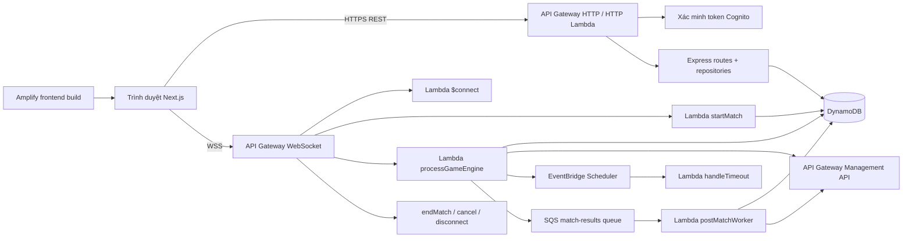
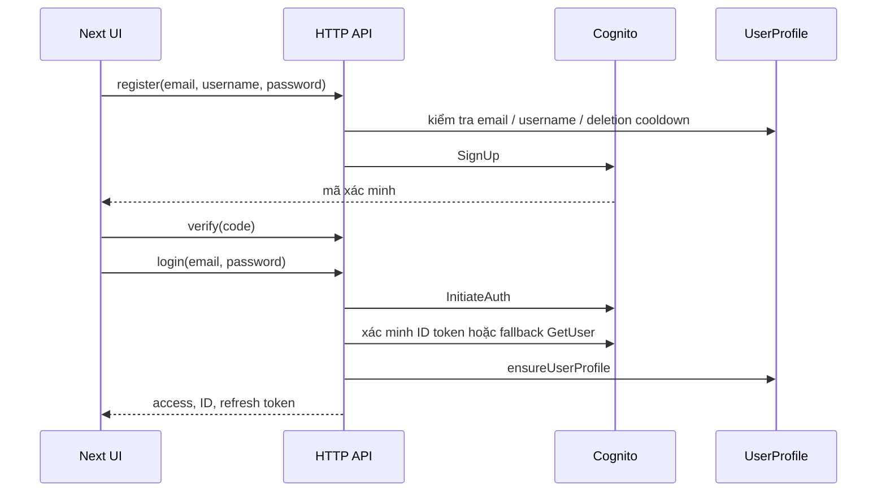
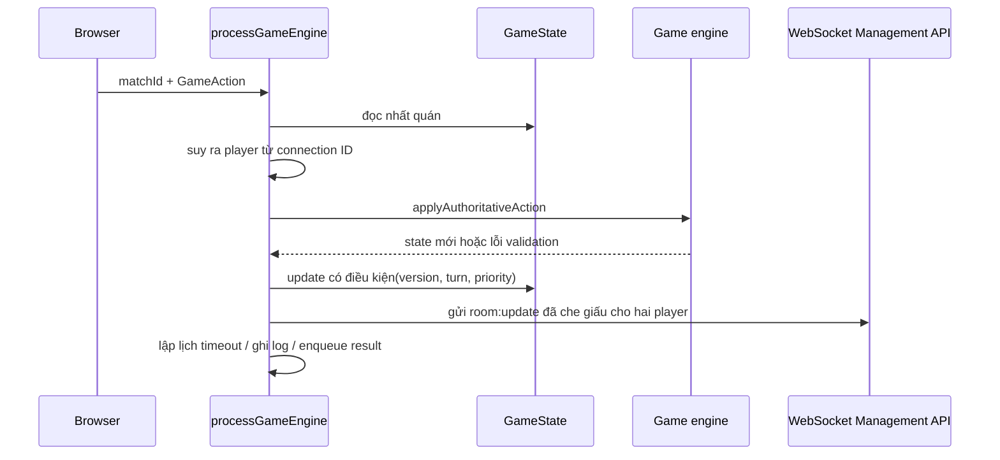

# Kiến trúc dự án TCG / Kaleidoscope

> Tài liệu được tạo từ mã nguồn và cấu hình hiện có trong repository vào ngày 2026-09-16. Nội dung mô tả hành vi đã kiểm chứng. Các nhận định ghi **SUY DIỄN** hoặc **CHƯA XÁC ĐỊNH** chưa được chứng minh bằng template triển khai được commit trong repository.

## 1. Tổng quan dự án

Đây là game thẻ bài sưu tầm viết bằng TypeScript, gồm frontend Next.js và backend định hướng serverless. Backend hiện có hai mô hình thực thi song song:

- **Luồng định hướng production:** API Gateway WebSocket gọi Lambda; Lambda lưu trận đấu có thẩm quyền trong DynamoDB và gửi state đã che giấu qua API Gateway Management API. HTTP được đóng gói qua `@codegenie/serverless-express`.
- **Luồng local/prototype:** `Back-end/src/server/index.ts` khởi động Express và Socket.IO, dùng room, matchmaking và timer trong bộ nhớ tiến trình.

Game engine là mã TypeScript dùng chung. Engine hoạt động theo kiểu state machine/reducer: kiểm tra action, áp dụng chuyển trạng thái, phát event nội bộ, xử lý ability/effect, dọn unit đã chết và kiểm tra điều kiện thắng.

Repository chưa có đầy đủ định nghĩa tài nguyên backend của Amplify. `amplify.yml` chỉ cấu hình build frontend Next.js. Vì vậy mapping API Gateway, event mapping của Lambda, IAM policy, SQS event source, Scheduler target và thông tin resource Cognito production là **CHƯA XÁC ĐỊNH** từ mã nguồn hiện có.

## 2. Công nghệ sử dụng

| Khu vực | Công nghệ / bằng chứng |
|---|---|
| Ngôn ngữ/runtime | TypeScript, ESM, Node.js >=24 |
| Frontend | Next.js 15, React 19, Phaser 4.2.1/Phaser Splash, Tailwind/PostCSS, Zustand và các UI library |
| HTTP backend | Express 5, `@codegenie/serverless-express` |
| Realtime | API Gateway WebSocket + Management API trong Lambda; Socket.IO ở local |
| Xác thực | Amazon Cognito, xác minh JWKS bằng `jose`, cookie/bearer token |
| Lưu trữ | DynamoDB Document Client |
| Xử lý bất đồng bộ | Amazon SQS cho kết quả trận đấu |
| Lập lịch | AWS EventBridge Scheduler qua `@aws-sdk/client-scheduler` |
| Bằng chứng triển khai | Amplify frontend build; script đóng gói Lambda bằng esbuild |
| Kiểm thử | Vitest; kiểm tra TypeScript được ghi trong `readme.md` |

## 3. Cấu trúc dự án

```text
TCG-AWS/
├── Front-end/                 Ứng dụng Next.js, Phaser pages/components, hook và asset
├── Back-end/src/
│   ├── auth/                  Cognito, JWT verification, HTTP middleware
│   ├── aws-lambdas/           Entry point Lambda WebSocket và bất đồng bộ
│   ├── config/                Environment và client DynamoDB
│   ├── database/              Khởi tạo bảng và kiểu persistence
│   ├── decks/                 Kiểm tra payload deck
│   ├── game/                  Game engine có thẩm quyền
│   ├── http/                  Express app và REST route
│   ├── leaderboard/           Projection, ranking, realtime notification
│   ├── matchmaking/           Queue/ELO local trong bộ nhớ
│   ├── user/                  Repository profile/deck và user service
│   ├── shared/                Contract multiplayer dùng chung frontend/backend
│   └── server/                Bootstrap Express + Socket.IO local
├── scripts/                   Đóng gói Lambda bằng esbuild
├── amplify.yml                Chỉ cấu hình build frontend của Amplify
├── package.json               Command và dependency
└── Architecture.md            Báo cáo kiến trúc tiếng Anh
```

`Back-end/src/database/setupTables.ts` định nghĩa các bảng `UserProfile`, `AccountDeletionCooldown`, `GameState`, `GameLogs`, `Connections` và `MatchHistory`, đều dùng on-demand billing. Đây là script bootstrap, không phải bộ IaC triển khai hoàn chỉnh.

## 4. Tổng quan kiến trúc



DynamoDB là ranh giới dữ liệu bền vững. Lambda stateless; `GameState.engine_state` là snapshot có thẩm quyền. Ghi có điều kiện tạo optimistic concurrency cho action và timeout.

## 5. Trách nhiệm module và component

- **Frontend:** route và UI trong `Front-end/src/app`, hiển thị game trong `components/game`, điều phối trong `hooks/useGameMatch.ts`, REST trong `libs/api.ts`, chọn transport trong `libs/socket.ts` và `libs/apiGatewaySocket.ts`.
- **HTTP:** `Back-end/src/http/app.ts` kiểm tra origin, parse JSON/cookie, gắn auth route, match/deck/leaderboard/user route và health endpoint. `aws-lambdas/httpBackend.ts` bọc app này cho Lambda.
- **Auth:** `auth.service.ts` xử lý đăng ký, login và password flow; middleware nhận access token từ cookie hoặc bearer header; `verifyToken.ts` kiểm tra issuer, chữ ký JWKS, `token_use` và client ID.
- **Vòng đời trận:** `startMatch.ts` tạo/resume room và public/private match; `connectHandler.ts` xác thực và lưu/rebind connection; `processGameEngine.ts` xử lý action; `handleTimeout.ts` xử lý AFK timeout; `endMatch.ts`, `cancelMatch.ts`, `disconnectHandler.ts` xử lý kết thúc và kết nối.
- **Game engine:** `game/core/engine.ts` điều phối validation, state transition, ability, effect, trigger, graveyard cleanup, champion progress và win check. `game/rules` giữ luật; `game/operations` giữ thao tác nguyên tử; `game/entities` giữ card definition/instance và registry.
- **Kết quả và xếp hạng:** `matchResultQueue.ts` gửi trận hoàn tất vào SQS; `postMatchWorker.ts` cập nhật profile/history theo transaction; `rebuildLeaderboardRanks.ts` xếp hạng định kỳ và gửi notification.
- **Local server:** `server/index.ts` mount HTTP route trùng lặp và giữ room Socket.IO trong bộ nhớ. Đây là đường phát triển local, không cùng mô hình persistence với Lambda.

## 6. Entry point và vòng đời ứng dụng

### Frontend

`npm run dev` chạy `next dev Front-end`; `npm run build` và `npm start` build/serve Next app. Amplify chạy `npm ci` và `npm run build` với `Front-end` là `appRoot`.

### Luồng HTTP production

API Gateway gọi `aws-lambdas/httpBackend.ts`, adapter của `http/app.ts`. App kiểm tra origin, parse cookie/JSON, xác thực route được bảo vệ, gọi repository/AWS client và trả JSON.

### Luồng WebSocket production

1. Browser lấy hoặc refresh Cognito access token.
2. `ApiGatewaySocket` mở `NEXT_PUBLIC_WS_URL` với token và username trong query parameter.
3. API Gateway gọi `connectHandler.ts`; handler xác thực Cognito, ghi `Connections` và có thể rebind match đang khôi phục.
4. Route gọi `startMatch.ts` cho public matchmaking, tạo/tham gia private room hoặc resume.
5. Action gọi `processGameEngine.ts`; surrender có thể gọi `endMatch.ts`.
6. Disconnect gọi `disconnectHandler.ts`; entry queue cũ bị xóa và player active được đánh dấu disconnected.
7. Schedule timeout gọi `handleTimeout.ts` bất đồng bộ.

### Vòng đời local

`npm run dev:socket` chạy `server/index.ts`, tạo HTTP server, mount Express, gắn Socket.IO và giữ room/state/timer trong bộ nhớ. `MatchmakingService`, `OnlinePlayerManager` và `MatchmakingQueue` chỉ dùng cho local.

## 7. Luồng chính

### Đăng ký và đăng nhập



### Matchmaking và tạo room

`startMatch.ts` hỗ trợ public/private match, kiểm tra deck, lấy profile người dùng authoritative, dùng lock DynamoDB cho public matchmaking, tạo record `WAITING` và chuyển thành `IN_PROGRESS` khi ghép đủ người. Record lưu user ID, connection ID, deck đã chọn, profile, engine state, version và TTL. Mapping chính xác giữa API Gateway route và Lambda là **CHƯA XÁC ĐỊNH**.

### Action có thẩm quyền



`COMMIT_BLOCKS` được theo sau bởi `RESOLVE_COMBAT` ở server trong cùng Lambda invocation để tránh race giữa hai message của client.

### Trận đấu hoàn tất

Engine ghi `FINISHED`, winner, end reason và timestamp. Một message được đưa vào SQS. `postMatchWorker.ts` đọc lại GameState, từ chối match lỗi/chưa kết thúc, tính ELO, cập nhật hai profile và hai history cùng idempotency marker trong một DynamoDB transaction, rồi gửi realtime profile notification ở chế độ best-effort.

## 8. Luồng dữ liệu

1. Cognito cung cấp identity token; ứng dụng dùng `sub` làm user ID.
2. Profile cung cấp username, avatar, ELO, thống kê và deck đã lưu.
3. Match start chuyển card ID được chọn hoặc deck mặc định thành card instance và lưu `GameState` ban đầu.
4. WebSocket action đọc, kiểm tra, biến đổi rồi ghi thay thế `engine_state` có điều kiện.
5. Message gửi cho từng player che hand và deck của đối thủ bằng card instance giả.
6. `GameLogs` ghi action/timeout/end độc lập với state đã commit.
7. SQS chỉ truyền tín hiệu hoàn tất và match ID; worker tin GameState đã commit hơn các field winner/player trong message.
8. Projection profile của worker phục vụ `LeaderboardIndex`; rebuild định kỳ gán rank và gửi rank-change event.

## 9. Luồng sự kiện

Có hai hệ thống event khác nhau:

- **Event nội bộ đồng bộ:** `game/core/events.ts` và `game/mechanics/triggers.ts` phát event như card play, spell cast, unit death, damage và champion level-up. Ability enqueue effect; operation thay đổi state; cleanup lặp lại đến khi ổn định.
- **Event AWS bất đồng bộ:** API Gateway WebSocket event gọi Lambda; EventBridge Scheduler gọi timeout Lambda; SQS gọi post-match worker. Chưa thấy EventBridge event bus trực tiếp; chỉ xác minh được Scheduler client.

Các message quan trọng gồm `room:update`, `room:created`, `matchmaking:found`, `matchmaking:cancelled`, `match:ended`, `match:resume_required`, `profile:updated` và `rank:changed`.

## 10. Quản lý state và chuyển trạng thái

Game state chứa hai player, phase, active/priority player, attack token, round/mana, board/hand/deck/graveyard, combat, effect queue, pending choice, champion progress, visual events, timestamp lượt và field kết thúc. Kiểu đầy đủ nằm trong `game/types.ts`.

Trạng thái trận thường là:

```text
WAITING -> IN_PROGRESS -> FINISHED
   |             |          |
 cancel       timeout    post-match worker
 disconnect   surrender   history/rating
```

Trong `IN_PROGRESS`, phase hợp lệ thường là `ACTION -> BLOCK -> COMBAT -> ACTION`; `DISCARD` và pending ability choice là các trạng thái chặn. `validateAction` từ chối action sau khi có winner, sai player/phase, khi choice chưa được giải quyết hoặc khi quá hạn lượt. `checkWinConditions` xử lý Nexus bị phá và trường hợp cả hai Nexus bị phá; timeout và surrender có end reason riêng.

Concurrency dùng optimistic locking: `processGameEngine` và `handleTimeout` kiểm tra status, state version, timestamp lượt và priority player trước khi ghi. Condition fail tạo conflict hoặc no-op, không ghi đè chuyển trạng thái mới.

## 11. Giao tiếp API và dịch vụ

### HTTP route

Các route Express cung cấp authentication, `/matches`, `/decks`, `/leaderboard` và `/user`. Local bootstrap còn định nghĩa một số route deck và pending match trùng lặp. `GET /health` chỉ có trong `http/app.ts`.

### WebSocket route

Client production dùng `matchfinding-start`, `room-create`, `room-join`, `game-action`, `game-surrender` và `matchfinding-cancel`. Socket.IO local dùng `matchmaking:start`, `room:create`, `room:join`, `game:action`, `game:reset`, `developer:resources` và `matchmaking:cancel`. Adapter trong `libs/socket.ts` chuyển đổi hai contract.

### Transport outbound

Lambda dùng `ApiGatewayManagementApiClient.PostToConnectionCommand`; connection đã bị xóa được xem là tình huống cleanup bình thường. Browser dùng native WebSocket cho API Gateway và `socket.io-client` cho local.

## 12. Database và mô hình dữ liệu

| Bảng | Khóa | Vai trò |
|---|---|---|
| `UserProfile` | `user_id`; GSI `LeaderboardIndex` trên `leaderboard_scope` + `leaderboard_sort` | identity, stats, deck, rank và leaderboard projection |
| `AccountDeletionCooldown` | `email` | cooldown đăng ký 24 giờ sau xóa tài khoản |
| `GameState` | `match_id` | vòng đời trận, player, connection, engine snapshot, version, TTL |
| `GameLogs` | `match_id` + `action_sequence` | audit action/timeout/end |
| `Connections` | `connection_id` | socket đã xác thực và match hiện tại |
| `MatchHistory` | `user_id` + `played_at` | lịch sử trận theo từng người chơi |

Code thường scan `GameState`, `UserProfile` và `Connections` vì `setupTables.ts` chưa định nghĩa GSI phục vụ matchmaking/query tương ứng. Cách này phù hợp prototype nhỏ nhưng là rủi ro mở rộng.

Có hai vocabulary kiểu dữ liệu: engine hiện tại dùng camelCase (`engine_state` chứa `players`, `nexusHp`, ...), trong khi `database.types.ts` chứa mô hình game cũ dạng snake_case. Kiểu cũ không phải shape mà Lambda engine hiện tại sử dụng, tạo bất nhất kiến trúc.

## 13. Xác thực và phân quyền

- Cognito là identity provider cho đăng ký, xác minh, đăng nhập, refresh, logout, khôi phục mật khẩu và global sign-out.
- HTTP nhận access token từ cookie `access_token` hoặc `Authorization: Bearer`, rồi kiểm tra issuer/JWKS Cognito, `token_use=access` và client ID.
- WebSocket `$connect` lấy token từ query hoặc bearer header, xác minh tương tự rồi ghi `Connections`.
- HTTP dùng `sub` đã xác minh để phân quyền; WebSocket suy ra P1/P2 từ connection ID và từ chối action có `playerId` không khớp.
- `processGameEngine` từ chối `RESOLVE_COMBAT` từ client, các action chỉ dành cho server, lượt quá hạn và connection không hợp lệ.
- **Rủi ro:** access token nằm trong URL WebSocket có thể xuất hiện trong proxy/access log. Việc redaction log khi deploy là **CHƯA XÁC ĐỊNH**.

## 14. Tích hợp bên ngoài

- **Amazon Cognito:** xác thực user pool và JWKS endpoint.
- **Amazon DynamoDB:** toàn bộ state bền vững qua AWS SDK v3.
- **API Gateway WebSocket:** event kết nối/route vào và Management API để gửi ra.
- **SQS:** truyền kết quả trận với batch failure reporting.
- **EventBridge Scheduler:** mỗi state version có một schedule timeout; target là `handleTimeout` qua IAM scheduler role.
- **Amplify:** chỉ xác minh được build/deploy frontend. Provisioning backend là **CHƯA XÁC ĐỊNH**.
- **Secrets Manager / STS:** `config/dynamodb.ts` có đường credential tùy chọn; Lambda mặc định dùng execution role.

## 15. Cấu hình và môi trường

Các biến quan trọng gồm `AWS_REGION`/`DB_REGION`, override tên bảng, `COGNITO_REGION`, `COGNITO_USER_POOL_ID`, `COGNITO_CLIENT_ID`, Cognito client secret tùy chọn, `FRONTEND_ORIGINS`, `WS_MANAGEMENT_ENDPOINT`, `SQS_MATCH_RESULTS_QUEUE_URL`, `TURN_TIMEOUT_SCHEDULER_ROLE_ARN`, `HANDLE_TIMEOUT_LAMBDA_ARN`, scheduler group, TTL match/queue, ELO range và `NEXT_PUBLIC_API_URL`, `NEXT_PUBLIC_WS_URL`, `NEXT_PUBLIC_SOCKET_URL` của frontend.

Local đọc `Back-end/.env`; Lambda bỏ qua dotenv. Giá trị thật của `.env` không được ghi vào tài liệu. Environment Cognito bắt buộc được kiểm tra khi module khởi tạo, nên thiếu cấu hình có thể làm cold start thất bại.

Script dự án build từng Lambda bằng esbuild thành zip. Không có template được commit để chứng minh cách upload zip, mapping route hoặc tạo IAM.

## 16. Logic nghiệp vụ quan trọng

- Hằng số game gồm Nexus ban đầu 20 HP, tối đa 10 mana, 3 spell mana, 4 card ban đầu, hand tối đa 6 và board tối đa 6 unit.
- Action rule kiểm tra priority, phase, attack token, card có thể chơi, sacrifice cost, pending target và combat.
- Effect gồm damage, heal, draw/discard, buff/debuff, keyword, summon, graveyard, recall/rebirth/revive và lọc card.
- Champion progress theo dõi unit chết, spell, damage vào Nexus và champion strike; card/unit đủ điều kiện sẽ level up qua registry definition.
- ELO dùng K-factor 32. Hậu xử lý cộng EXP 100 khi thắng, 35 khi thua, 50 khi hòa; level tính từ EXP.
- Leaderboard sắp xếp theo ELO, win rate, số trận thắng và user ID bằng chuỗi fixed-width; rebuild định kỳ gán rank và dùng conditional write để không ghi đè profile mới hơn.

## 17. Phụ thuộc và liên kết chặt

- Lambda phụ thuộc chặt vào tên thuộc tính/bảng DynamoDB, event shape API Gateway và environment variable.
- Game engine là ranh giới dùng lại quan trọng nhất: Socket.IO local và action/timeout serverless cùng gọi engine.
- `GameState` là aggregate lớn. Mỗi action đọc và ghi lại toàn bộ snapshot, liên kết rules, card registry, effect và persistence.
- Realtime delivery phụ thuộc connection ID được lưu, nhưng được thiết kế best-effort sau khi state commit.
- Tính đúng của post-match phụ thuộc status/winner của GameState và condition của profile; SQS có thể replay an toàn nhờ `post_match_processed_at`.
- HTTP route và `server/index.ts` có logic trùng, gây nguy cơ drift.

## 18. Mẫu kiến trúc

- Lambda stateless, DynamoDB là ranh giới state bền vững.
- State machine/reducer có server làm authority.
- Event-driven ability và effect queue.
- Optimistic concurrency bằng conditional write và state version.
- Hậu xử lý kết quả kiểu outbox qua SQS với idempotency transaction.
- Projection cho leaderboard.
- Adapter giữa Socket.IO local và API Gateway WebSocket.
- Push notification best-effort sau khi persistence thành công.

## 19. Rủi ro và bất nhất quan trọng

1. **Thiếu định nghĩa triển khai:** không tìm thấy Amplify/CDK/SAM/Serverless/IaC backend hoàn chỉnh. Topology production, permission, route mapping, SQS trigger, Scheduler role và TTL/index chưa thể kiểm chứng.
2. **Hai runtime:** Socket.IO local dùng room trong bộ nhớ; production dùng DynamoDB. Hành vi, recovery, authorization và race handling có thể khác nhau.
3. **HTTP route trùng lặp:** `server/index.ts` và `http/app.ts` mount endpoint chồng lấn, đặc biệt là `/decks`.
4. **Điều phối bằng scan:** matchmaking, pending match, connection rebind và rebuild leaderboard dùng scan. Chi phí và latency tăng theo quy mô.
5. **Lệch schema:** `database.types.ts` dùng game state snake_case cũ, còn engine/Lambda dùng state camelCase.
6. **Ghi aggregate lớn:** thay toàn bộ engine state ở mỗi action làm tăng item size, chi phí ghi và contention.
7. **Nhiều Scheduler:** mỗi state version tạo một EventBridge schedule. IAM/config lỗi hoặc cleanup lỗi có thể để lại schedule cũ; tính đúng dựa vào version check.
8. **Delivery từng phần:** WebSocket push và audit log không thuộc transaction state. Thiết kế ưu tiên state đã commit nên client cần reconnect/resume.
9. **Credential phức tạp:** Secrets Manager, cross-account role, static key và Lambda role tạo nhiều nhánh cấu hình. Production nên tắt static credential.
10. **Token trên URL:** WebSocket gửi token qua query parameter. Cần xác nhận gateway/access log đã che token.
11. **Phạm vi Amplify chưa rõ:** mã nguồn chỉ chứng minh Amplify build frontend, chưa chứng minh Amplify quản lý backend resources.

## 20. File và entry point chính

| Mối quan tâm | File chính |
|---|---|
| Frontend build | `Front-end/src/app`, `Front-end/src/hooks/useGameMatch.ts`, `Front-end/src/libs/api.ts`, `Front-end/src/libs/socket.ts`, `Front-end/src/libs/apiGatewaySocket.ts` |
| HTTP Lambda | `Back-end/src/aws-lambdas/httpBackend.ts`, `Back-end/src/http/app.ts` |
| WebSocket connect | `Back-end/src/aws-lambdas/connectHandler.ts` |
| Vòng đời trận | `startMatch.ts`, `cancelMatch.ts`, `disconnectHandler.ts`, `endMatch.ts` |
| Action có thẩm quyền | `processGameEngine.ts`, `game/core/authoritativeAction.ts`, `game/core/engine.ts` |
| Timeout | `turnTimeoutScheduler.ts`, `handleTimeout.ts` |
| Xử lý kết quả | `matchResultQueue.ts`, `postMatchWorker.ts` |
| Xếp hạng | `leaderboard/leaderboard.ts`, `rebuildLeaderboardRanks.ts`, `leaderboard/routes.ts` |
| Auth | `auth.service.ts`, `auth.middleware.ts`, `verifyToken.ts`, `auth.routes.ts` |
| Persistence | `config/dynamodb.ts`, `database/setupTables.ts`, `user/user.repository.ts` |
| Runtime local | `server/index.ts`, `matchmaking/*` |
| Đóng gói | `scripts/build-lambda.mjs`, `scripts/build-http-lambda.mjs` |

## 21. Mô hình tư duy hệ thống

Hãy xem hệ thống như **một match aggregate bền vững được bao quanh bởi các event handler stateless**:

```text
Browser
  -> Cognito token
  -> HTTP cho identity/deck/history/rank
  -> WebSocket cho command trận và thông báo state
       -> Lambda xác thực connection và command
       -> Game engine tính một state transition
       -> DynamoDB commit snapshot có điều kiện
       -> WebSocket gửi snapshot đã che giấu theo player
       -> Scheduler xử lý timeout hoặc SQS xử lý sau trận
  -> Frontend reconnect/resume từ match bền vững thay vì tin state local
```

Invariant quan trọng nhất là: **`GameState.engine_state` đã commit trong DynamoDB, được bảo vệ bởi state version và điều kiện lượt, là nguồn sự thật; browser state, field trong SQS, log và realtime notification chỉ là dữ liệu phụ.** Để production đáng tin cậy hơn, cần làm rõ và thống nhất định nghĩa hạ tầng, schema và ranh giới local/serverless.
