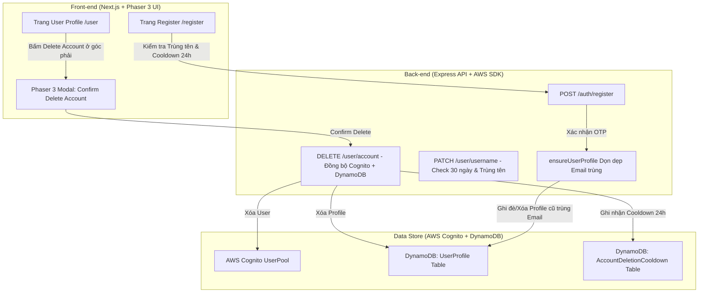

# Kế hoạch Kỹ thuật Chi tiết: Triển khai Nâng cấp UserProfile, Đăng ký / Đăng nhập & Quản lý Tài khoản (Dành cho AI Execution Agent)

Tài liệu thiết kế kiến trúc chi tiết dành cho Model Execution (**GPT 5.6 Luna Medium**) thực thi nâng cấp hệ thống Authentication, UserProfile, Ràng buộc Tên người chơi duy nhất (30-day cooldown) và Xóa tài khoản đồng bộ (24-hour re-registration cooldown) chuẩn giao diện Phaser 3 / Prism Arena.

---

## 🏗️ 1. Tổng quan Kiến trúc & Các Luồng Nâng cấp (Architectural Blueprint)

---

## 🛠️ 2. Chi tiết Triển khai Backend (Back-end Implementation Specs)

### 2.1 Cấu trúc Dữ liệu & Repository ([user.repository.ts](file:///k:/Catullus/AWS/Chrono%20Game%20Genesis/Codigo/TCG-AWS/Back-end/src/user/user.repository.ts))

#### 1. Bổ sung Bảng / Record Cooldown Xóa tài khoản (`AccountDeletionCooldown`):
* Tạo helper quản lý cooldown 24h khi xóa email:
  * Key `email` (String, normalized lowercase).
  * `deletedAt` (Number, timestamp epoch ms).
  * `availableAt` (Number, `deletedAt + 24 * 60 * 60 * 1000`).
* Thêm các hàm vào `user.repository.ts`:
  * `isEmailInDeletionCooldown(email: string): Promise<{ inCooldown: boolean; availableAt?: number }>`
  * `recordAccountDeletionCooldown(email: string): Promise<void>`

#### 2. Cập nhật `ensureUserProfile({ id, email, username })`:
* Trước khi `putItem` tạo profile mới, thực hiện query/scan tìm profile cũ trong DynamoDB có `email === normalizedEmail` nhưng `id !== newUserId`.
* Nếu phát hiện profile cũ -> Gọi `deleteUserProfile(oldProfile.id)` trước khi tạo profile mới.
* **Mục đích**: Đảm bảo **Strict Email Uniqueness (1 Email = 1 Profile)** trong DynamoDB.

#### 3. Bổ sung Kiểm tra Tên duy nhất (`findUserByUsername`):
* Tạo hàm `findUserByUsername(username: string): Promise<UserProfile | null>` trong `user.repository.ts`.
* Quét tìm tên trong DynamoDB (case-insensitive / normalized).

---

### 2.2 Cập nhật Auth & User Service ([auth.service.ts](file:///k:/Catullus/AWS/Chrono%20Game%20Genesis/Codigo/TCG-AWS/Back-end/src/auth/auth.service.ts) & [user.service.ts](file:///k:/Catullus/AWS/Chrono%20Game%20Genesis/Codigo/TCG-AWS/Back-end/src/user/user.service.ts))

#### 1. Nâng cấp `register(data: RegisterRequest)`:
* **Kiểm tra 1: Cooldown 24h sau khi xóa**:
  * Kiểm tra `isEmailInDeletionCooldown(email)`. Nếu `inCooldown === true`, ném ra lỗi:
    > `"This email was recently deleted. You must wait 24 hours before registering again with this email."`
* **Kiểm tra 2: Tên Operative đã tồn tại**:
  * Gọi `findUserByUsername(username)`. Nếu đã có người sử dụng, ném ra lỗi:
    > `"Operative callsign '${username}' is already taken by another player."`

#### 2. Nâng cấp API `updateUsername(userId: string, newUsername: string)`:
* **Kiểm tra 1: Tên trùng**:
  * Nếu `newUsername` trùng với user khác trong DB -> Throw `Error("Operative callsign is already taken.")`.
* **Kiểm tra 2: Cooldown 30 ngày**:
  * Kiểm tra thuộc tính `lastNameChangedAt` trên `UserProfile`.
  * Nếu `profile.lastNameChangedAt` tồn tại và `Date.now() - profile.lastNameChangedAt < 30 * 24 * 60 * 60 * 1000` -> Throw lỗi:
    > `"You can only change your operative callsign once every 30 days."`
* Cập nhật `username` và gán `lastNameChangedAt = Date.now()`.

#### 3. Bổ sung API `deleteAccount(userId: string, email: string)`:
* **Endpoint**: `DELETE /user/account` (yêu cầu authentication token).
* **Các bước thực thi**:
  1. Gọi `recordAccountDeletionCooldown(email)` ghi nhận mốc 24h.
  2. Gọi `deleteUserProfile(userId)` xóa hồ sơ khỏi DynamoDB.
  3. Gọi `cognito.send(new AdminDeleteUserCommand({ UserPoolId: env.userPoolId, Username: email }))` xóa tài khoản khỏi AWS Cognito.
  4. Trả về `{ success: true, message: "Account deleted successfully." }`.

---

## 🎨 3. Chi tiết Triển khai Frontend (Front-end Implementation Specs)

### 3.1 Trang Đăng ký ([app/register/page.tsx](file:///k:/Catullus/AWS/Chrono%20Game%20Genesis/Codigo/TCG-AWS/Front-end/src/app/register/page.tsx))

1. **Hiển thị Cảnh báo Trùng Tên Operative (Inline Alert Line)**:
   * Khi người dùng nhập tên hoặc khi form validate, nếu Backend/Validate trả về lỗi trùng tên, hiển thị dòng cảnh báo màu cam/đỏ chuẩn Phaser 3 dưới ô nhập tên:
     * UI: Icon `AlertTriangle` + Dòng chữ *"Callsign 'XXXX' is already taken."*.
2. **Hiển thị Banner Cooldown 24h khi Đăng ký lại Email vừa xóa**:
   * Nếu bấm Register với email đang trong thời gian 24h cooldown, hiển thị khối `.auth-notice` chuẩn Phaser 3:
     * Header: `REGISTRATION RESTRICTED`
     * Body: *"This email address was deleted within the last 24 hours. Please wait until the cooldown period expires before signing up again."*

---

### 3.2 Trang User Profile ([app/user/page.tsx](file:///k:/Catullus/AWS/Chrono%20Game%20Genesis/Codigo/TCG-AWS/Front-end/src/app/user/page.tsx))

1. **Bổ sung Nút "Delete Account" ở góc dưới bên phải**:
   * Vị trí: Đặt cố định hoặc nằm ở footer trang `user/page.tsx` ở góc dưới bên phải.
   * Styling: Thiết kế chuẩn phong cách chiến thuật Phaser 3 / Prism Arena (Nút viền đỏ, icon `Trash2`, hiệu ứng glowing đỏ khi hover).
2. **Thiết kế Modal Popup Cảnh báo Xóa Tài khoản (Phaser 3 / Prism Terminal Style)**:
   * Mở Modal khi click nút "Delete Account".
   * **Tiêu đề**: `TERMINATE OPERATIVE PROFILE`
   * **Nội dung cảnh báo (Bắt buộc theo yêu cầu)**:
     > *"Are you sure you want to delete your account? If you delete your account, your present email can only be used to sign up again after 1 day (24-hour cooldown)."*
   * **Nút bấm**:
     * `CANCEL`: Đóng modal.
     * `CONFIRM DELETION`: Gọi API `deleteAccount()` -> Xóa toàn bộ `localStorage` / `sessionStorage` -> Chuyển hướng người dùng về `/login?deleted=1`.

---

## 📋 4. Kế hoạch Kiểm tra & Xác minh (Verification Steps)

1. **Test Trùng tên Operative**:
   * Đăng ký User A với Username `ViViKhang`.
   * Thử đăng ký User B với Username `ViViKhang` -> Đảm bảo trang Register hiển thị dòng cảnh báo trùng tên.
2. **Test 30 ngày Đổi tên**:
   * User A tiến hành đổi tên thành `NewCallsign`.
   * Thử đổi tên lại ngay lập tức -> Đảm bảo nhận được thông báo lỗi 30 ngày cooldown.
3. **Test Xóa Tài khoản & Cooldown 24h**:
   * Đăng nhập User A, vào trang `/user`, bấm nút **"Delete Account"** ở góc dưới bên phải.
   * Popup modal hiển thị đúng thông điệp cảnh báo. Bấm xác nhận xóa -> Đăng xuất và về trang Login.
   * Thử đăng ký lại ngay lập tức với email của User A vừa xóa -> Trang Register chặn lại và hiển thị thông báo cooldown 24 giờ!
4. **Automated Build Check**:
   * Chạy `npx next build` đảm bảo không có lỗi TypeScript hay build break.
